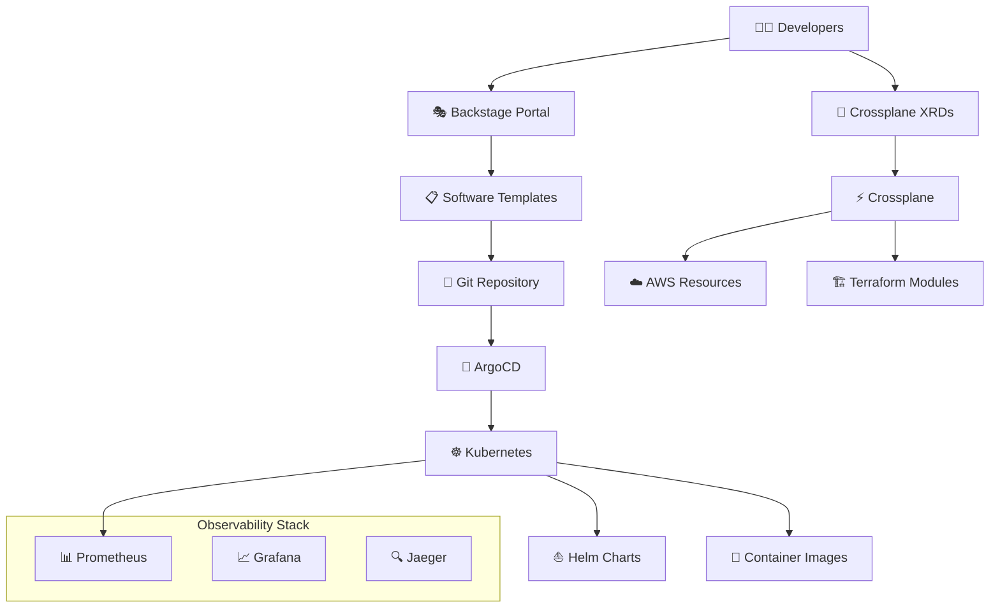

# Platform Engineering Framework

Este repositório implementa uma plataforma completa de engenharia usando as melhores práticas de Cloud Native e GitOps, com Crossplane como núcleo central para abstração e autoatendimento de infraestrutura.

## 🚀 Quick Start

```bash
# Clone o repositório
git clone https://github.com/nataliagranato/plataform-engineer.git
cd plataform-engineer

# Configure AWS credentials
aws configure

# Provisione infraestrutura
cd infrastructure/terraform/environments/dev
terraform init && terraform apply -auto-approve

# Instale Crossplane
cd ../../../crossplane/install
./install.sh

# Instale ArgoCD
kubectl apply -f ../../argocd/install/argocd.yaml

# Instale Observabilidade
kubectl apply -f ../../observability/prometheus/prometheus.yaml
kubectl apply -f ../../observability/grafana/grafana.yaml
```

📖 **[Guia Completo de Instalação](docs/tutorials/quick-start.md)**

## 🏗️ Arquitetura da Plataforma



## 📦 Estrutura do Projeto

```
📦 plataform-engineer/
├── 📁 .github/workflows/      # CI/CD Pipelines
├── 📁 infrastructure/
│   ├── 📁 terraform/          # 🏗️ IaC base com Terraform
│   │   ├── 📁 environments/   # Ambientes (dev/staging/prod)
│   │   ├── 📁 modules/        # Módulos reutilizáveis
│   │   └── 📁 shared/         # Recursos compartilhados
│   └── 📁 crossplane/         # ⚡ Crossplane Control Plane
│       ├── 📁 install/        # Instalação do Crossplane
│       ├── 📁 providers/      # Cloud providers
│       ├── 📁 compositions/   # XRDs e Compositions
│       └── 📁 claims/         # Resource Claims
├── 📁 kubernetes/             # Manifests Kubernetes
├── 📁 helm/                   # Helm Charts
├── 📁 argocd/                 # ArgoCD Applications
├── 📁 backstage/              # Developer Portal
├── 📁 docker/                 # Container Images
├── 📁 observability/          # Monitoring Stack
└── 📁 docs/                   # Documentação
```

## 🛠️ Componentes Principais

| Componente | Tecnologia | Propósito |
|------------|------------|-----------|
| **🏗️ IaC Base** | Terraform | Provisioning de infraestrutura cloud |
| **⚡ Control Plane** | Crossplane | Abstração e autoatendimento de recursos |
| **🎭 Developer Portal** | Backstage | Catálogo de serviços e templates |
| **🔄 GitOps** | ArgoCD | Continuous Delivery |
| **📊 Monitoring** | Prometheus | Coleta de métricas |
| **📈 Dashboards** | Grafana | Visualização e alertas |
| **🔍 Tracing** | Jaeger | Distributed tracing |
| **⛵ Packaging** | Helm | Gerenciamento de aplicações |

## 🎯 Funcionalidades

### ✅ Para Desenvolvedores
- 🎭 **Self-Service Portal**: Interface amigável via Backstage
- 📋 **Templates Prontos**: Scaffold automático de aplicações
- 🚀 **Deploy Automático**: GitOps com ArgoCD
- 📊 **Observabilidade Built-in**: Metrics, logs e tracing

### ✅ Para Platform Engineers
- 🏗️ **IaC Declarativo**: Terraform + Crossplane
- 🔧 **Abstrações Reutilizáveis**: XRDs e Compositions
- 🛡️ **Security by Default**: Policies e guardrails
- 📈 **Multi-Cloud Ready**: AWS, Azure, GCP

### ✅ Para Operations
- 🔍 **Observabilidade Completa**: Prometheus + Grafana + Jaeger
- 🚨 **Alertas Inteligentes**: SLIs/SLOs automáticos
- 🔄 **GitOps Workflow**: Auditoria e compliance
- 🎛️ **Multi-Cluster Management**: Gerenciamento centralizado

## 🚦 Status dos Componentes

| Componente | Status | Versão | Documentação |
|------------|--------|---------|--------------|
| 🏗️ Terraform | ✅ Pronto | 1.6+ | [📖 Docs](docs/architecture/overview.md) |
| ⚡ Crossplane | ✅ Pronto | 1.14+ | [📖 Quick Start](docs/tutorials/quick-start.md) |
| 🔄 ArgoCD | ✅ Pronto | 2.9+ | [📖 Guide](docs/tutorials/quick-start.md) |
| 📊 Prometheus | ✅ Pronto | 2.48+ | [📖 Setup](observability/prometheus/) |
| 📈 Grafana | ✅ Pronto | 10.2+ | [📖 Setup](observability/grafana/) |
| 🎭 Backstage | 🚧 Em Progresso | Latest | [📖 Config](backstage/config/) |
| 🔍 Jaeger | 📝 Planejado | 1.50+ | - |
| 📋 Fluentd | 📝 Planejado | Latest | - |

## 🎓 Getting Started

### Pré-requisitos
- Kubernetes 1.28+
- Helm 3.13+
- Terraform 1.6+
- AWS CLI configurado

### Instalação Rápida
1. **📖 [Quick Start Guide](docs/tutorials/quick-start.md)** - Configuração em 10 minutos
2. **🏗️ [Architecture Overview](docs/architecture/overview.md)** - Entenda a arquitetura
3. **🔧 [Runbooks](docs/runbooks/)** - Guias operacionais

### Exemplos de Uso

```yaml
# Exemplo: Criando uma aplicação via Crossplane
apiVersion: platform.io/v1alpha1
kind: Application
metadata:
  name: my-app
spec:
  parameters:
    name: my-app
    environment: dev
    replicas: 3
    database:
      enabled: true
      engine: postgresql
```

## 🤝 Contribuindo

1. **Fork** o repositório
2. **Crie** uma branch: `git checkout -b feature/nova-funcionalidade`
3. **Commit** suas mudanças: `git commit -m 'Add: nova funcionalidade'`
4. **Push** para a branch: `git push origin feature/nova-funcionalidade`
5. **Abra** um Pull Request

📖 **[Guia de Contribuição](CONTRIBUTING.md)**

## 📚 Documentação

- 📖 **[Architecture Overview](docs/architecture/overview.md)** - Visão geral da arquitetura
- 🚀 **[Quick Start Guide](docs/tutorials/quick-start.md)** - Configuração rápida
- 🔧 **[Runbooks](docs/runbooks/)** - Guias operacionais
- 🎓 **[Tutorials](docs/tutorials/)** - Tutoriais passo a passo

## 🛣️ Roadmap

### v1.0 (Atual)
- [x] Terraform modules para AWS
- [x] Crossplane providers e compositions
- [x] ArgoCD setup e applications
- [x] Prometheus + Grafana stack
- [x] CI/CD pipelines

### v1.1 (Próxima)
- [ ] Backstage completamente funcional
- [ ] Jaeger distributed tracing
- [ ] Fluentd log aggregation
- [ ] Multi-cloud support (Azure, GCP)

### v2.0 (Futuro)
- [ ] Machine Learning Ops integration
- [ ] Advanced security scanning
- [ ] Cost optimization automation
- [ ] Service mesh integration

## 📊 Métricas


## 🔗 Links Úteis

- 🌐 **[Crossplane](https://crossplane.io/)** - Universal Control Plane
- 🎭 **[Backstage](https://backstage.io/)** - Developer Portal
- 🔄 **[ArgoCD](https://argoproj.github.io/cd/)** - GitOps for Kubernetes
- 📊 **[Prometheus](https://prometheus.io/)** - Monitoring
- 📈 **[Grafana](https://grafana.com/)** - Observability

## 📞 Suporte

- 🐛 **[Issues](https://github.com/nataliagranato/plataform-engineer/issues)** - Reporte bugs
- 💬 **[Discussions](https://github.com/nataliagranato/plataform-engineer/discussions)** - Perguntas e discussões
- 📧 **[Email](mailto:contato@nataliagranato.xyz)** - Contato direto

---

⭐ **Se este projeto te ajudou, considere dar uma estrela!**

Feito com ❤️ por [Natália Granato](https://github.com/nataliagranato).
