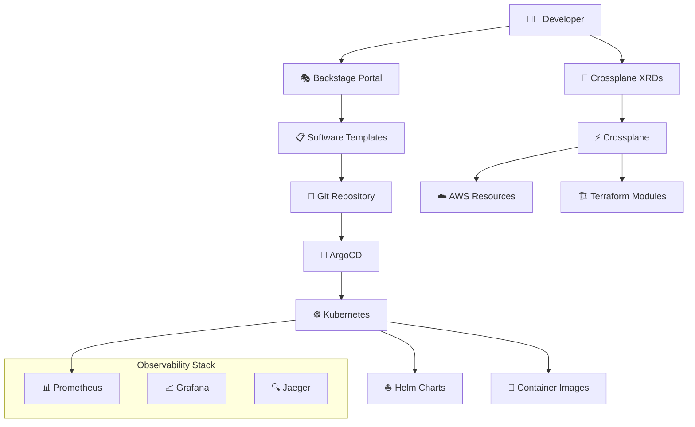

# Platform Engineering Architecture

## Visão Geral

Este projeto implementa uma plataforma de engenharia moderna usando as melhores práticas de Cloud Native e GitOps. A arquitetura é baseada em Crossplane como núcleo central para abstração e autoatendimento de infraestrutura.

## Componentes Principais

### 🏗️ Crossplane
- **Propósito**: Control Plane universal para gerenciamento de infraestrutura como código
- **Funcionalidades**:
  - Provisioning declarativo de recursos
  - Composições reutilizáveis
  - Abstrações de alto nível para desenvolvedores
  - Suporte multi-cloud (AWS, Azure, GCP)

### 🎭 Backstage
- **Propósito**: Portal de desenvolvedores e catálogo de serviços
- **Funcionalidades**:
  - Catálogo de componentes e sistemas
  - Templates de scaffold para novos projetos
  - Documentação centralizada
  - Integração com ferramentas de CI/CD

### 🔄 ArgoCD
- **Propósito**: Continuous Delivery para Kubernetes
- **Funcionalidades**:
  - GitOps workflow
  - Sincronização automática
  - Rollback e health checking
  - Multi-cluster management

### 📊 Stack de Observabilidade
- **Prometheus**: Monitoramento e alertas
- **Grafana**: Dashboards e visualização
- **Jaeger**: Distributed tracing
- **Fluentd**: Coleta de logs

## Fluxo de Trabalho



## Estrutura de Diretórios

```
📦 plataform-engineer/
├── 📁 .github/workflows/      # CI/CD Pipelines
├── 📁 infrastructure/
│   ├── 📁 terraform/          # 🏗️ IaC base com Terraform
│   │   ├── 📁 environments/   # Ambientes (dev/staging/prod)
│   │   ├── 📁 modules/        # Módulos reutilizáveis
│   │   └── 📁 shared/         # Recursos compartilhados
│   └── 📁 crossplane/         # ⚡ Crossplane Control Plane
│       ├── 📁 install/        # Instalação do Crossplane
│       ├── 📁 providers/      # Cloud providers (AWS, Azure, GCP)
│       ├── 📁 compositions/   # XRDs e Compositions
│       └── 📁 claims/         # Resource Claims
├── 📁 kubernetes/
│   ├── 📁 base/              # Manifests base
│   ├── 📁 overlays/          # Kustomize overlays
│   └── 📁 operators/         # Custom operators
├── 📁 helm/
│   ├── 📁 charts/            # Charts customizados
│   └── 📁 values/            # Values por ambiente
├── 📁 argocd/
│   ├── 📁 install/           # ArgoCD installation
│   ├── 📁 applications/      # ArgoCD Applications
│   ├── 📁 projects/          # ArgoCD Projects
│   └── 📁 repositories/      # Repository definitions
├── 📁 backstage/
│   ├── 📁 catalog/           # Service catalog
│   ├── 📁 templates/         # Software templates
│   ├── 📁 plugins/           # Custom plugins
│   └── 📁 config/            # Backstage configuration
├── 📁 docker/
│   ├── 📁 base-images/       # Base images
│   ├── 📁 security/          # Security policies
│   └── 📁 registries/        # Registry configs
├── 📁 observability/
│   ├── 📁 prometheus/        # Monitoring
│   ├── 📁 grafana/          # Dashboards
│   ├── 📁 jaeger/           # Distributed tracing
│   └── 📁 fluentd/          # Log collection
└── 📁 docs/
    ├── 📁 architecture/      # Architecture docs
    ├── 📁 runbooks/         # Operational runbooks
    └── 📁 tutorials/        # Tutorials & guides
```

## Princípios de Design

### 1. **Declarativo por Design**
- Todos os recursos são definidos de forma declarativa
- Estado desejado vs estado atual
- Reconciliação contínua

### 2. **GitOps First**
- Git como única fonte da verdade
- Pull-based deployments
- Auditoria e compliance automáticos

### 3. **Self-Service Infrastructure**
- Abstrações de alto nível para desenvolvedores
- Provisioning automatizado
- Guardrails e políticas de segurança

### 4. **Observabilidade Integrada**
- Monitoring, logging e tracing built-in
- SLIs/SLOs definidos
- Alertas proativos

### 5. **Security by Default**
- Least privilege access
- Network policies
- Image scanning
- Secrets management

## Padrões de Uso

### Para Desenvolvedores
1. Acesse o Backstage Portal
2. Escolha um template de aplicação
3. Preencha os parâmetros necessários
4. O scaffold é criado automaticamente
5. ArgoCD faz o deploy automaticamente

### Para Platform Engineers
1. Defina XRDs no Crossplane
2. Crie Compositions reutilizáveis
3. Configure policies e guardrails
4. Monitore uso e performance

### Para Operations
1. Monitore através do Grafana
2. Configure alertas no Prometheus
3. Investigue issues com Jaeger
4. Gerencie logs com Fluentd

## Tecnologias Utilizadas

| Componente | Tecnologia | Versão | Propósito |
|------------|------------|---------|-----------|
| Container Runtime | Kubernetes | 1.28+ | Orquestração de containers |
| GitOps | ArgoCD | 2.9+ | Continuous Delivery |
| IaC Abstraction | Crossplane | 1.14+ | Universal Control Plane |
| Developer Portal | Backstage | Latest | Service Catalog |
| Monitoring | Prometheus | 2.48+ | Metrics collection |
| Visualization | Grafana | 10.2+ | Dashboards |
| Tracing | Jaeger | 1.50+ | Distributed tracing |
| Package Manager | Helm | 3.13+ | Application packaging |
| Infrastructure | Terraform | 1.6+ | Cloud provisioning |
| Registry | ECR/Harbor | Latest | Container images |

## Próximos Passos

1. **Setup Inicial**
   - Configure credentials AWS
   - Execute terraform apply
   - Instale Crossplane
   - Configure ArgoCD

2. **Configuração de Segurança**
   - Configure RBAC
   - Setup OIDC/SSO
   - Implemente network policies
   - Configure secrets management

3. **Onboarding de Times**
   - Treine desenvolvedores no Backstage
   - Configure templates específicos
   - Defina SLOs e SLIs
   - Estabeleça runbooks

4. **Otimização**
   - Tune performance
   - Otimize custos
   - Refine observabilidade
   - Automatize mais processos
